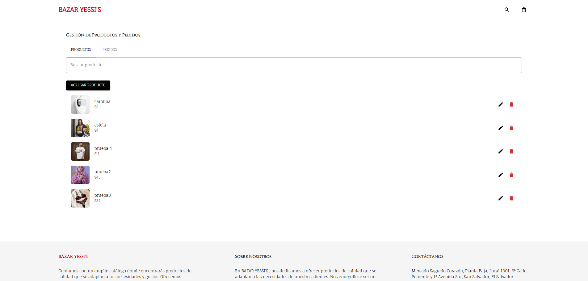
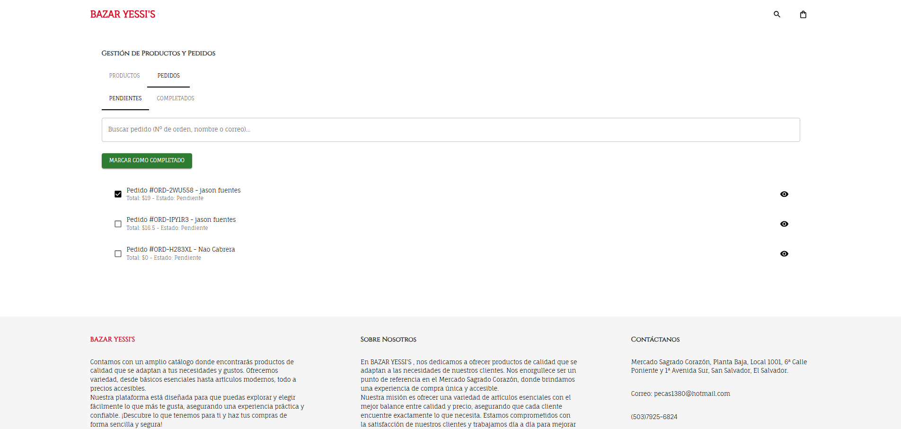

# 🛍️ Yessis Bazar – Web App

**Yessis Bazar** is a modern web application designed to manage and showcase products for an online bazaar. The platform allows customers to browse and place orders, while administrators can manage the catalog and track orders with ease.

---

## 🚀 Technologies Used

- **React.js** – Modern and responsive UI
- **Firebase** – Backend services including authentication, database, and hosting
- **Firestore** – Real-time NoSQL database


---

## 🧩 Key Features

### 👤 Customer Side
- Browse available products
- View detailed product information
- Place orders quickly and easily

### 🛠️ Admin Panel
- Secure login via Firebase Authentication
- Add, edit, and delete products
- View a complete list of placed orders
- marked orders as completed or pending
---

## 📸 Screenshots

| Home Page | Product Management | Order Overview |
|-----------|--------------------|----------------|
|  |  |  |

> 📁 Screenshots should be placed in a `/screenshots/` folder within the repo.

---

## 🔐 Security Notice

🔑 The Firebase API key is protected via HTTP referrer restrictions, ensuring it only works from the authorized GitHub Pages domain.

---

## 📦 Local Installation (Optional)

```bash
git clone https://github.com/yourusername/yessis-bazar.git
cd yessis-bazar
npm install
npm start
